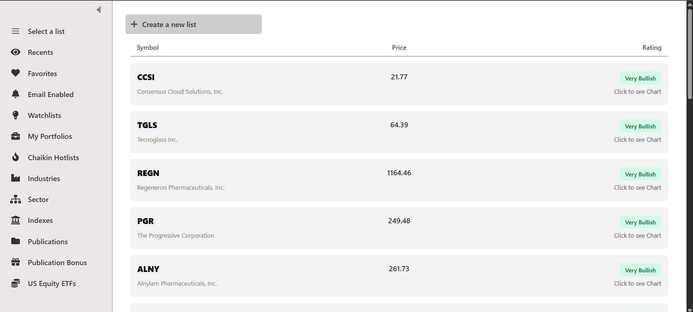
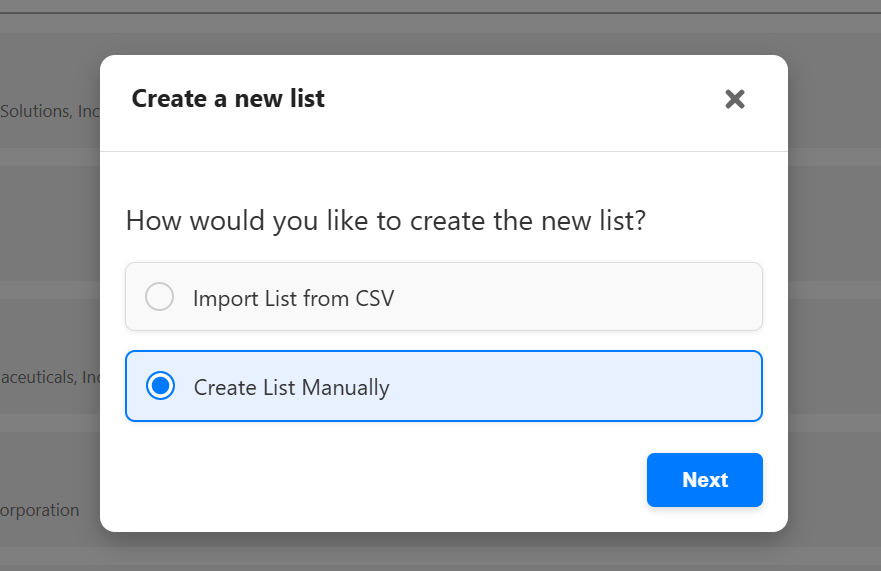
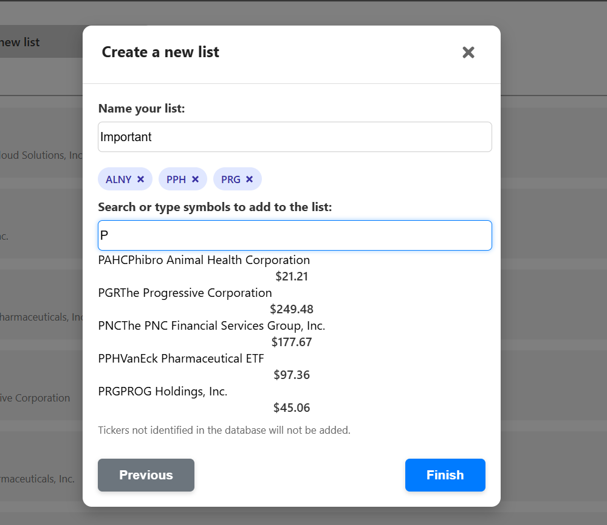
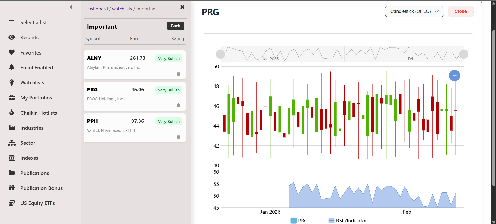

# MarketPulse Full-Stack Dashboard

A high-performance stock market visualization platform built to demonstrate proficiency in **Full-Stack development**. This project showcases a secure, authenticated environment for managing stock watchlists and analyzing market trends through custom data visualizations.

## 🛠️ Technical Highlights

* **Secure Authentication**: Implemented a robust security layer using **JWT (JSON Web Tokens)** stored in **httpOnly cookies** to prevent XSS attacks.
* **Role-Based Access Control (RBAC)**: Includes specialized middleware (`isAuth`, `isAdmin`) to protect sensitive routes and manage user permissions.
* **Custom Data Visualization**: Integrated **D3.js** for linear price charts with custom mathematical scaling and **AmCharts** for technical candlestick analysis.
* **RESTful API Design**: A modular Express backend with clean separation of concerns across controllers, routes, and middleware.
* **Relational Database**: Utilized **PostgreSQL** and **Sequelize ORM** to manage data for users, watchlists, and ticker items.

## 🚀 Tech Stack

**Frontend:**
* **React**: Component-based UI architecture.
* **SCSS**: Custom styling using a variables-based architecture.
* **AmCharts**: Professional financial data visualization.

**Backend:**
* **Node.js & Express**: Scalable server-side logic.
* **JWT & Bcrypt**: Secure authentication and password hashing.
* **PostgreSQL & Sequelize**: Relational data storage and ORM modeling.


## 📡 API Endpoints

### User & Auth
| Method | Endpoint | Description | Access |
| :--- | :--- | :--- | :--- |
| `POST` | `/api/user/signup` | Register a new user | Public |
| `POST` | `/api/user/login` | Login & receive JWT cookie | Public |
| `GET` | `/api/user/me` | Get current user profile | Authenticated |
| `GET` | `/api/user/all` | List all users | Admin Only |

### Stocks & Watchlists
| Method | Endpoint | Description | Access |
| :--- | :--- | :--- | :--- |
| `GET` | `/api/stocks/search` | Search for multiple stocks | Public |
| `POST` | `/api/stocks/watchlist` | Create a new watchlist | Authenticated |
| `GET` | `/api/stocks/watchlist/my` | Retrieve user's watchlists | Authenticated |
| `PATCH`| `/api/stocks/watchlist/:id/name` | Edit watchlist name | Authenticated |
| `DELETE`| `/api/stocks/watchlist/:id` | Remove a watchlist | Authenticated |

## ⚙️ Local Setup

1.  **Clone the repository**:
    ```bash
    git clone https://github.com/prigupta-eng/Market-Pulse
    ```

2.  **Environment Variables**: Create a `.env` file in the `/server` directory:
    ```env
    PORT=5000
    DB_NAME=auth_db
    DB_USER=postgres
    DB_PASSWORD=your_password
    DB_HOST=localhost
    DB_DIALECT=postgres
    JWT_SECRET=MY_SECRET_JWT_KEY
    ```

3.  **Install & Run**:
    ```bash
    # Install backend deps and start
    npm install
    node index.js

    # In a separate terminal, start frontend
    cd frontend
    npm install
    npm start
    ```


## 📸 Demo & Screenshots

### Dashboard Overview

*The main view showcasing the dynamic sidebar and stock lists.*

### List Creation

*Custom dialog to create list*

### Creating List Manually

*Dialog to create a list with keyword search*

### Data Visualization

*Custom AmCharts candlestick integration.*


